# SAAS

Índice público de produtos SaaS.

Este repositório é uma **capa de portfólio**: documenta o que foi entregue, a stack e os produtos ao vivo. O código de cada projeto fica em repositórios **privados** (clientes / NDA).

## Resumo

| Projeto | Stack | Status | Última alteração | Site |
|---------|-------|--------|------------------|------|
| Efathá Hosting Manager | Quarkus 3, React/TypeScript, Keycloak, PostgreSQL, Docker, Traefik | Em evolução | 26/09/2026 | [gestao.efathasolutions.com.br](https://gestao.efathasolutions.com.br) |

## Cases

### Efathá Hosting Manager

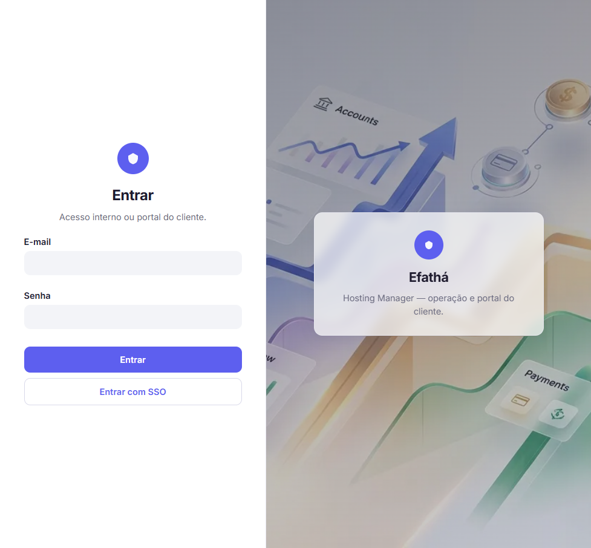

SaaS para gestão operacional e financeira de sites, landing pages e projetos hospedados — painel interno Efathá e portal do cliente (faturas, Pix, histórico), com bloqueio preferencial via roteamento no Traefik (sem substituir cPanel/Plesk).

- **Stack:** Java / Quarkus 3 (monólito modular), React + TypeScript, PostgreSQL, Keycloak (OIDC) + BFF, Docker + Traefik; integrações de cobrança/notificação atrás de ports
- **Entrega:** baseline documental (BMAP, PRD, SDD, TDD, BDD, ADRs) + implementação em andamento (RBAC com catálogo dinâmico de papéis, chrome do dashboard, gestão de usuários/perfis); painel em `gestao.efathasolutions.com.br`
- **Destaques técnicos:** um estado operacional por projeto; página pública neutra em `BLOQUEADO`; papéis dinâmicos no banco (em vez de enum fixo); agente de VPS com privilégios mínimos (evolução planejada)
- **Repositório:** `lMazer/efatha-hosting-manager` *(privado)*
- **Site:** [https://gestao.efathasolutions.com.br](https://gestao.efathasolutions.com.br)

#### Galeria

Capturas do painel (ambiente de teste / admin local).

| Login | Dashboard | Clientes |
|:---:|:---:|:---:|
|  | 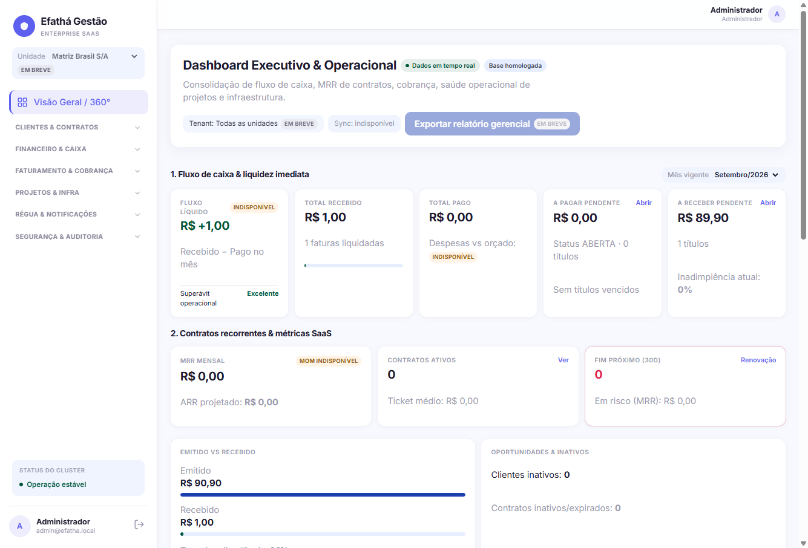 | 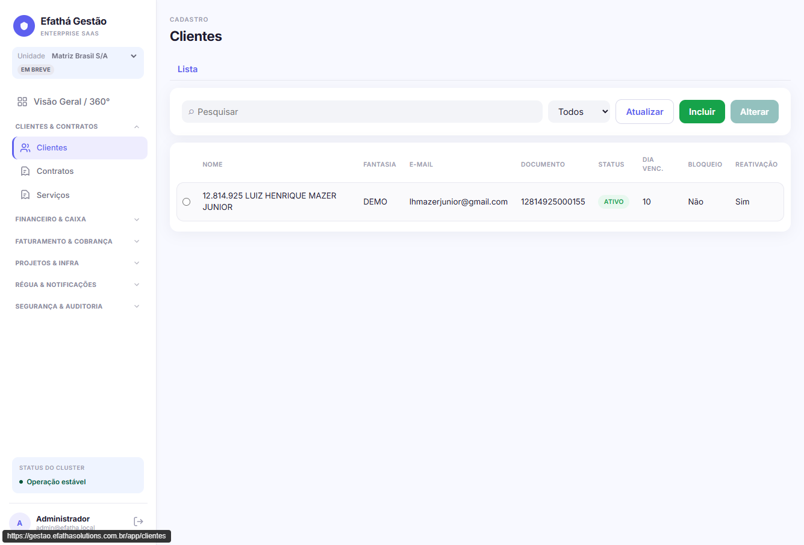 |
| **Contratos** | **Serviços** | **Contas a pagar** |
| 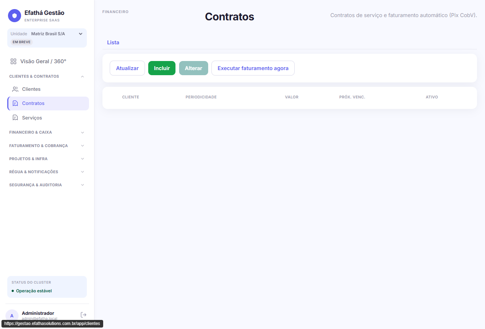 | 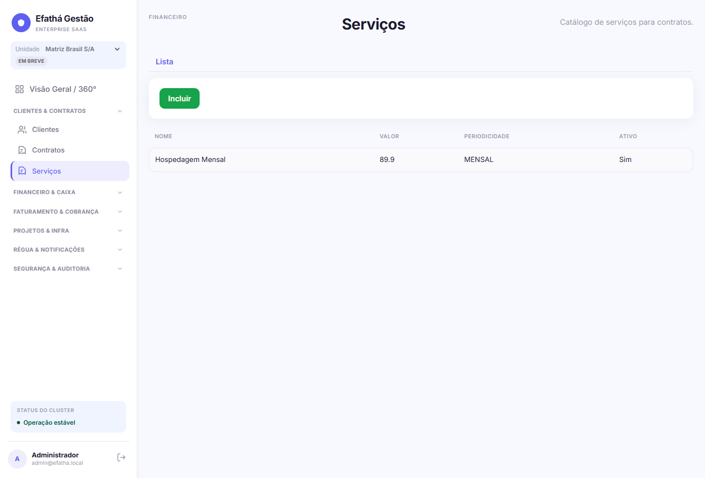 | 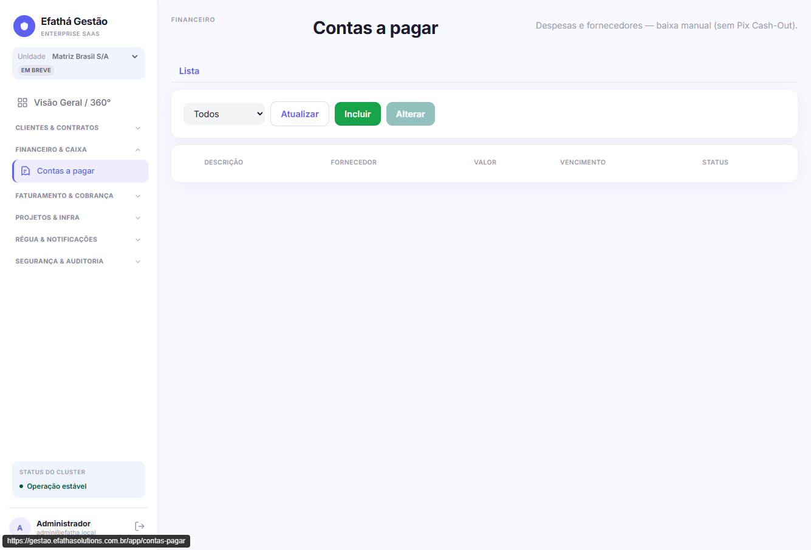 |
| **Contas a receber** | **Projetos** | **Servidores** |
| 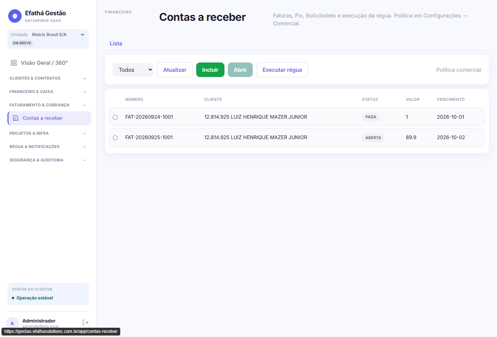 | 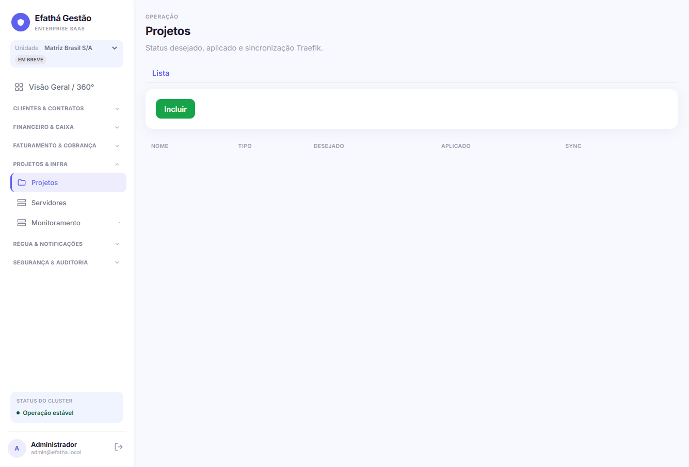 | 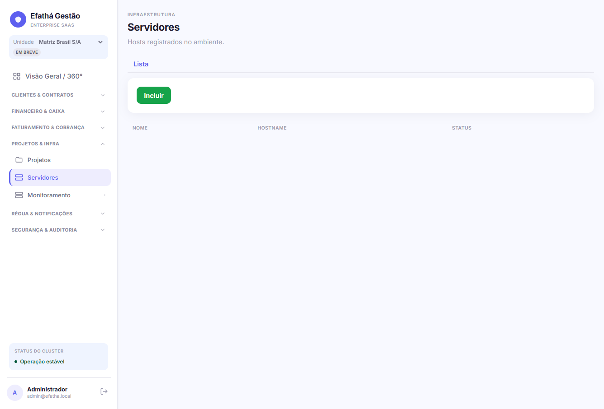 |
| **Usuários** | **Perfis (ACL)** | **Política comercial** |
| 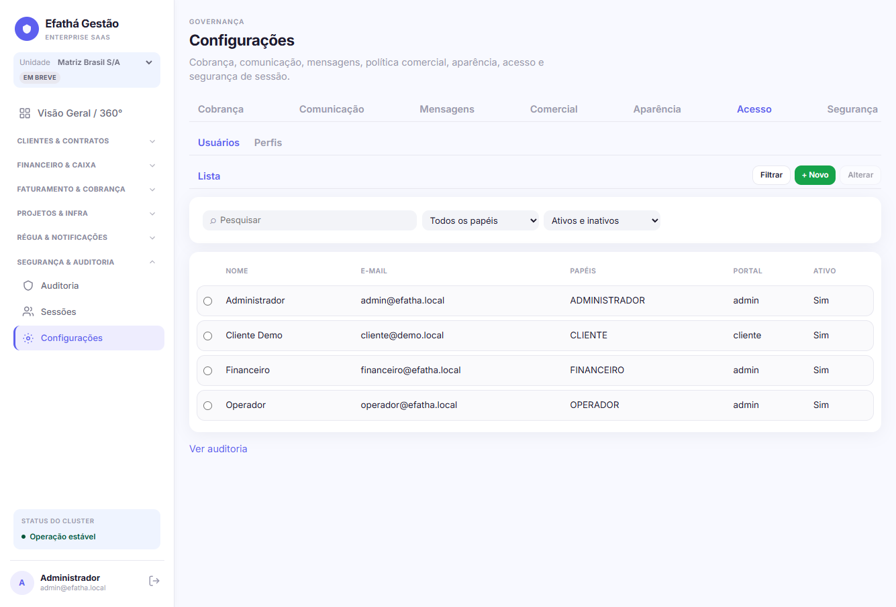 | 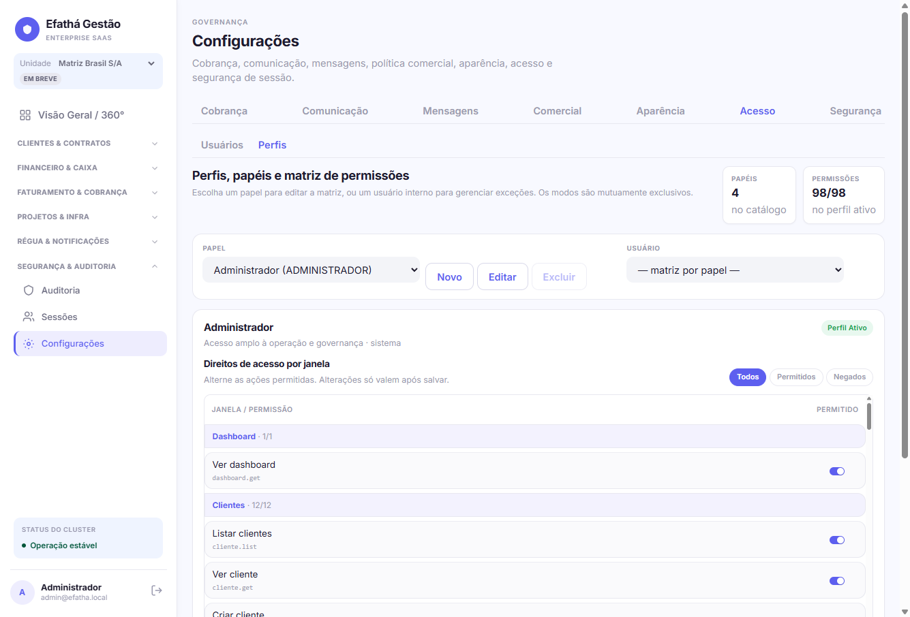 | 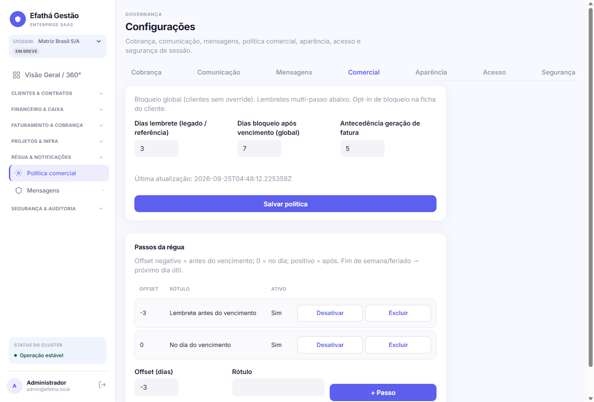 |
| **Aparência (login)** | **Sessões** | **Auditoria** |
| 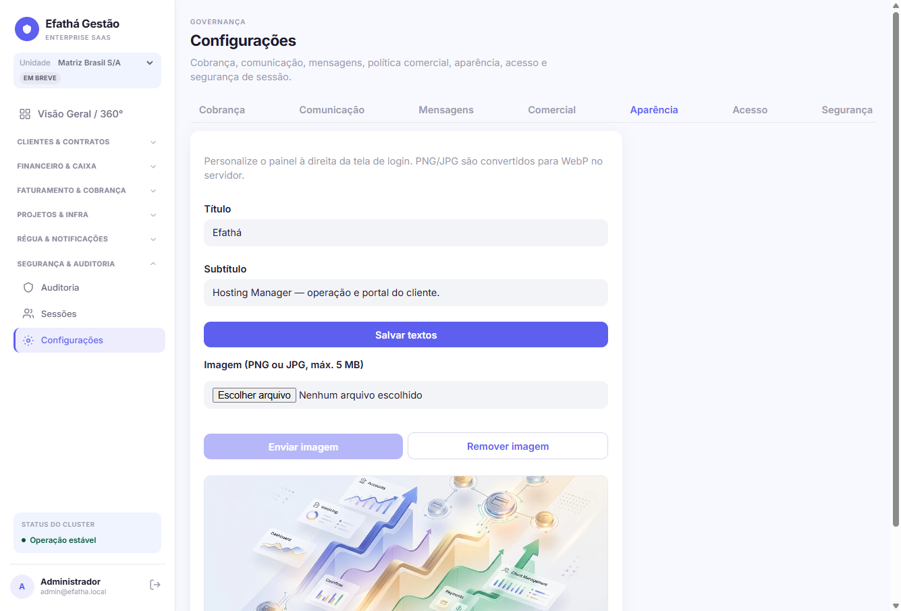 | 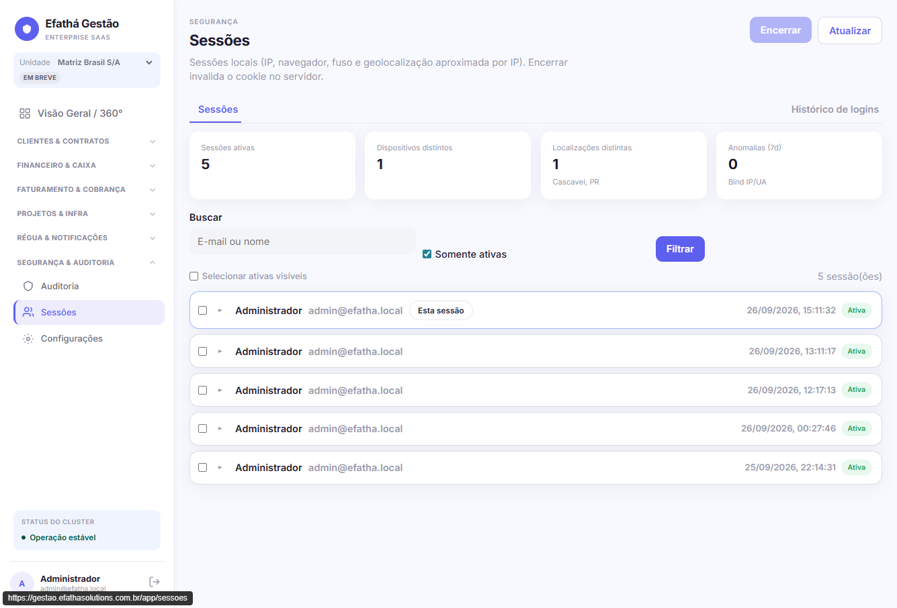 | 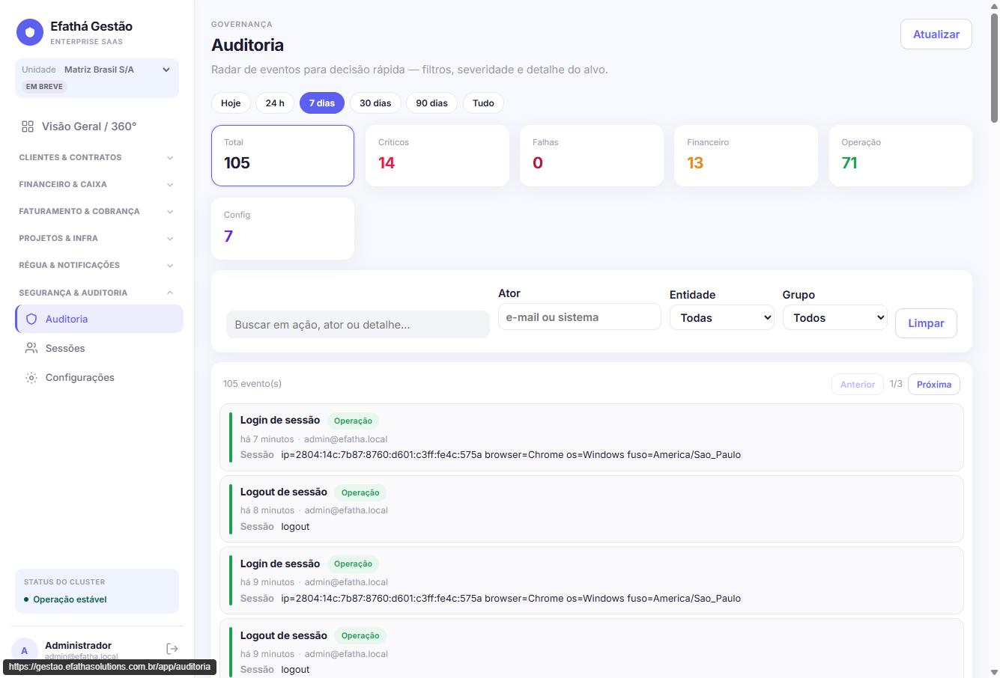 |

Projetos adicionais seguirão o template em [docs/ADDING_A_PROJECT.md](docs/ADDING_A_PROJECT.md).

## Padrões que sigo

- Layout responsivo (mobile → desktop)
- SEO básico (títulos, meta, sitemap/robots quando aplicável)
- Performance de assets (imagens otimizadas, peso consciente)
- Acessibilidade mínima (semântica HTML, contraste, navegação por teclado onde faz sentido)
- Documentação e caminho de deploy claros em cada projeto

## Como adicionar um novo projeto

Siga o template em [docs/ADDING_A_PROJECT.md](docs/ADDING_A_PROJECT.md).
